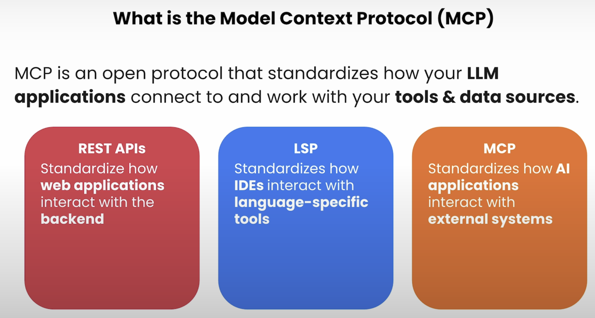
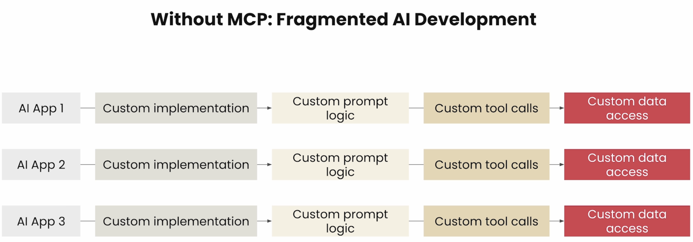
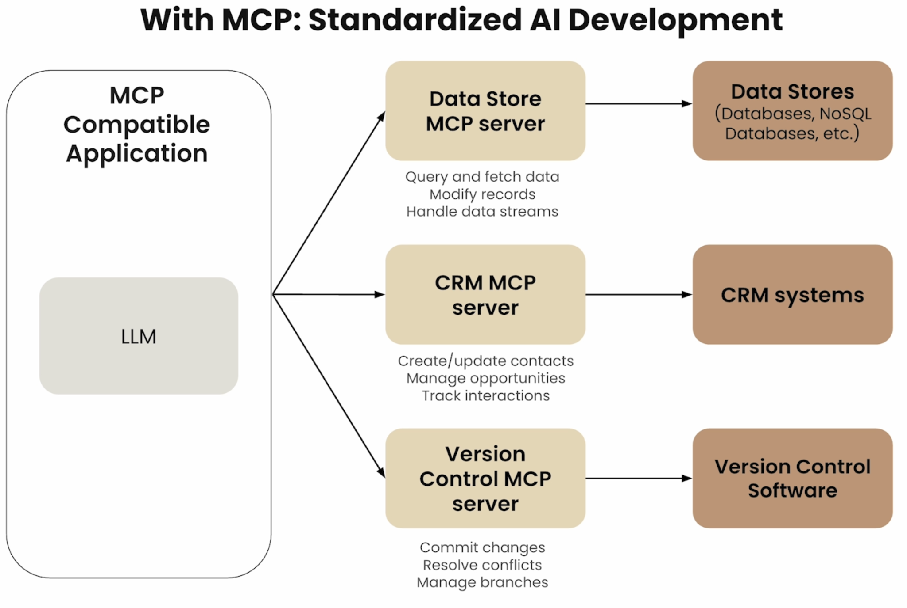
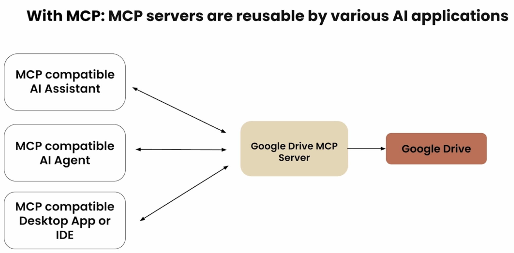

## Why MCP 

MCP is like a USB-C port for AI tools:
- Connects AI models to external data sources ad tools.
- Standardizes how models access information and resources 
- Solves the "How does my AI use tools" problem
- Created by Antropic, now used by Microsoft and Google tools

MCP is essential because models are only as good as the context given to them. The protocol provides a structured way to enhance model interactions through:

- Rich context management
- Tool integration
- Resource handling
- Structured communication

#### Key Comparisons:

